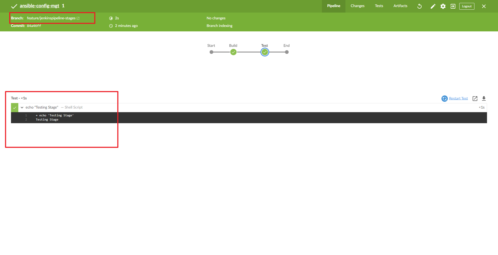
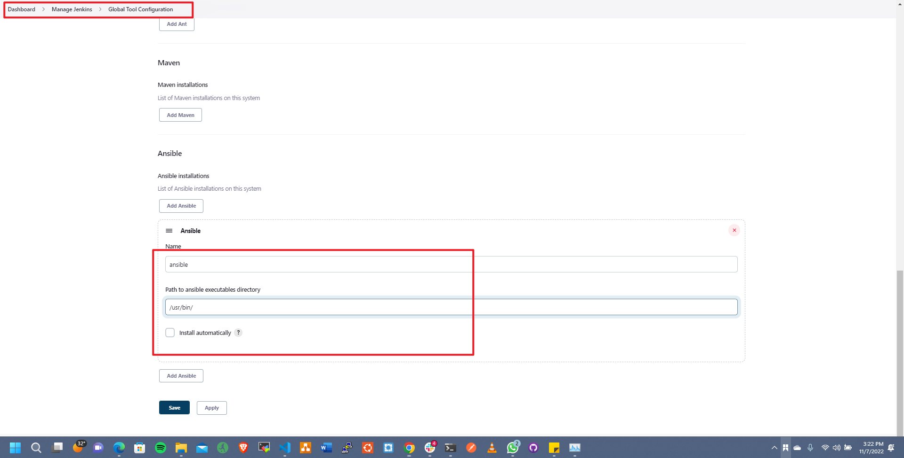

## **EXPERIENCE CONTINUOUS INTEGRATION WITH JENKINS | ANSIBLE | ARTIFACTORY | SONARQUBE | PHP**
===============================================================


## **Project Description:**


In this project, we will be setting up a CI/CD Pipeline for a PHP based application. The overall CI/CD process looks like the architecture above.

This project is architected in two major repositories with each repository containing its own CI/CD pipeline written in a Jenkinsfile

* ansible-config-mgt REPO: this repository contains JenkinsFile which is responsible for setting up and configuring infrastructure required to carry out processes required for our application to run. It does this through the use of ansible roles. This repo is infrastructure specific
  
* PHP-todo REPO : this repository contains jenkinsfile which is focused on processes which are application build specific such as building, linting, static code analysis, push to artifact repository etc.


## **Pre-requisites**

Will be making use of AWS virtual machines for this and will require 6 servers for the project which includes: Nginx Server: This would act as the reverse proxy server to our site and tool.

**Jenkins server:** To be used to implement your CI/CD workflows or pipelines. Select a t2.medium at least, Ubuntu 20.04 and Security group should be open to port 8080

**SonarQube server:** To be used for Code quality analysis. Select a t2.medium at least, Ubuntu 20.04 and Security group should be open to port 9000

**Artifactory server:** To be used as the binary repository where the outcome of your build process is stored. Select a t2.medium at least and Security group should be open to port 8081

**Database server:** To server as the databse server for the Todo application

**Todo webserver:** To host the Todo web application.


Ansible Inventory should look like this

```
├── ci
├── dev
├── pentest
├── pre-prod
├── prod
├── sit
└── uat
```

ci inventory file

```
[jenkins]
<Jenkins-Private-IP-Address>

[nginx]
<Nginx-Private-IP-Address>

[sonarqube]
<SonarQube-Private-IP-Address>

[artifact_repository]
<Artifact_repository-Private-IP-Address>
```

dev Inventory file

```
[tooling]
<Tooling-Web-Server-Private-IP-Address>

[todo]
<Todo-Web-Server-Private-IP-Address>

[nginx]
<Nginx-Private-IP-Address>

[db:vars]
ansible_user=ec2-user
ansible_python_interpreter=/usr/bin/python

[db]
<DB-Server-Private-IP-Address>
```

pentest inventory file

```
[pentest:children]
pentest-todo
pentest-tooling

[pentest-todo]
<Pentest-for-Todo-Private-IP-Address>

[pentest-tooling]
<Pentest-for-Tooling-Private-IP-Address>
```


## **ANSIBLE ROLES FOR CI ENVIRONMENT**

Now we go ahead and Add two more roles to ansible:

1. SonarQube (Scroll down to the Sonarqube section to see instructions on how to set up and configure SonarQube manually)

Why do we need SonarQube?
SonarQube is an open-source platform developed by SonarSource for continuous inspection of code quality, it is used to perform automatic reviews with static analysis of code to detect bugs, code smells, and security vulnerabilities.

2. Artifactory

Artifactory is a product by JFrog that serves as a binary repository manager. The binary repository is a natural extension to the source code repository, in that the outcome of your build process is stored. It can be used for certain other automation, but we will it strictly to manage our build artifacts.


Configuring Ansible For Jenkins Deployment

In previous projects, you have been launching Ansible commands manually from a CLI. Now, with Jenkins, we will start running Ansible from Jenkins UI.

To do this,

1. Navigate to Jenkins URL

2. Install & Open Blue Ocean Jenkins Plugin

3. Create a new pipeline


4. Select Github


5. Connect Jenkins with GitHub

6. Login to GitHub & Generate an Access Token

7. Copy Access Token


8. Paste the token and connect

9.  Create a new Pipeline


At this point you may not have a Jenkinsfile in the Ansible repository, so Blue Ocean will attempt to give you some guidance to create one. But we do not need that. We will rather create one ourselves. So, click on Administration to exit the Blue Ocean console.

### **Let us create our Jenkinsfile**

Inside the Ansible project, create a new directory `deploy` and start a new file `Jenkinsfile` inside the directory.


Add the code snippet below to start building the `Jenkinsfile` gradually. This pipeline currently has just one stage called Build and the only thing we are doing is using the `shell script` module to echo `Building Stage`

```
pipeline {
    agent any

  stages {
    stage('Build') {
      steps {
        script {
          sh 'echo "Building Stage"'
        }
      }
    }
    }
}
```

Now go back into the Ansible pipeline in Jenkins, and select configure


Back to the pipeline again, this time click "Build now"


This will trigger a build and you will be able to see the effect of our basic `Jenkinsfile` configuration by going through the console output of the build.

To really appreciate and feel the difference of Cloud Blue UI, it is recommended to try triggering the build again from Blue Ocean interface.

1. Click on Blue Ocean

2. Select your project

3. Click on the play button against the branch


Let us see this in action.

1. Create a new git branch and name it `feature/jenkinspipeline-stages`

2. Currently we only have the `Build` stage. Let us add another stage called `Test`. Paste the code snippet below and push the new changes to GitHub.

```
   pipeline {
    agent any

  stages {
    stage('Build') {
      steps {
        script {
          sh 'echo "Building Stage"'
        }
      }
    }

    stage('Test') {
      steps {
        script {
          sh 'echo "Testing Stage"'
        }
      }
    }
    }
}
```

3. To make your new branch show up in Jenkins, we need to tell Jenkins to scan the repository.

4. Navigate to the Ansible project and click on "Scan repository now"

5. Refresh the page and both branches will start building automatically. You can go into Blue Ocean and see both branches there too.

6. In Blue Ocean, you can now see how the Jenkinsfile has caused a new step in the pipeline launch build for the new branch




## **RUNNING ANSIBLE PLAYBOOK FROM JENKINS**


Now that you have a broad overview of a typical Jenkins pipeline. Let us get the actual Ansible deployment to work by:

For instructions on installations of the dependencies use the link below:

[here](https://github.com/Tonybesto/ansible-config/blob/main/README.md)

1. Installing Ansible on Jenkins


2. Installing Ansible plugin in Jenkins UI


3. Creating Jenkinsfile from scratch. (Delete all you currently have in there and start all over to get Ansible to run successfully)

```
pipeline {
  agent any

  environment {
      ANSIBLE_CONFIG="${WORKSPACE}/deploy/ansible.cfg"
    }

  parameters {
      string(name: 'inventory', defaultValue: 'dev',  description: 'This is the inventory file for the environment to deploy configuration')
    }

  stages{
      stage("Initial cleanup") {
          steps {
            dir("${WORKSPACE}") {
              deleteDir()
            }
          }
        }

      stage('Checkout SCM') {
         steps{
            git branch: 'main', url: 'https://github.com/Tonybesto/ansible-config.git'
         }
       }

      stage('Prepare Ansible For Execution') {
        steps {
          sh 'echo ${WORKSPACE}' 
          sh 'sed -i "3 a roles_path=${WORKSPACE}/roles" ${WORKSPACE}/deploy/ansible.cfg'  
        }
     }

      stage('Run Ansible playbook') {
        steps {
           ansiblePlaybook become: true, colorized: true, credentialsId: 'private-key', disableHostKeyChecking: true, installation: 'ansible', inventory: 'inventory/${inventory}', playbook: 'playbooks/site.yml'
         }
      }

      stage('Clean Workspace after build'){
        steps{
          cleanWs(cleanWhenAborted: true, cleanWhenFailure: true, cleanWhenNotBuilt: true, cleanWhenUnstable: true, deleteDirs: true)
        }
      }
   }

}
```

Some possible errors to watch out for:

* Ensure that the git module in Jenkinsfile is checking out SCM to main branch instead of master (GitHub has discontinued the use of Master)

* Jenkins needs to export the ANSIBLE_CONFIG environment variable. You can put the .ansible.cfg file alongside Jenkinsfile in the deploy directory. This way, anyone can easily identify that everything in there relates to deployment. Then, using the Pipeline Syntax tool in Ansible, generate the syntax to create environment variables to set. Enter this into the ancible.cfg file

```
[defaults]
roles_path= /home/ec2-user/ansible-config/roles
timeout = 160
callback_whitelist = profile_tasks
log_path=~/ansible.log
host_key_checking = False
gathering = smart
ansible_python_interpreter=/usr/bin/python3
allow_world_readable_tmpfiles=true


[ssh_connection]
ssh_args = -o ControlMaster=auto -o ControlPersist=30m -o ControlPath=/tmp/ansible-ssh-%h-%p-%r -o ServerAliveInterval=60 -o ServerAliveCountMax=60 -o ForwardAgent=yes
```

* Remember that ansible.cfg must be exported to environment variable so that Ansible knows where to find Roles. But because you will possibly run Jenkins from different git branches, the location of Ansible roles will change. Therefore, you must handle this dynamically. You can use Linux Stream Editor sed to update the section roles_path each time there is an execution. You may not have this issue if you run only from the main branch.

* If you push new changes to Git so that Jenkins failure can be fixed. You might observe that your change may sometimes have no effect. Even though your change is the actual fix required. This can be because Jenkins did not download the latest code from GitHub. Ensure that you start the Jenkinsfile with a clean up step to always delete the previous workspace before running a new one. Sometimes you might need to login to the Jenkins Linux server to verify the files in the workspace to confirm that what you are actually expecting is there. Otherwise, you can spend hours trying to figure out why Jenkins is still failing, when you have pushed up possible changes to fix the error.

* Another possible reason for Jenkins failure sometimes, is because you have indicated in the Jenkinsfile to check out the main git branch, and you are running a pipeline from another branch. So, always verify by logging onto the Jenkins box to check the workspace, and run git branch command to confirm that the branch you are expecting is there.

* Parameterizing Jenkinsfile For Ansible Deployment. So far we have been deploying to dev environment, what if we need to deploy to other environments? We will use parameterization so that at the point of execution, the appropriate values are applied. To parameterize Jenkinsfile For Ansible Deployment, Update CI inventory with new servers.

```
[tooling]
<SIT-Tooling-Web-Server-Private-IP-Address>

[todo]
<SIT-Todo-Web-Server-Private-IP-Address>

[nginx]
<SIT-Nginx-Private-IP-Address>

[db:vars]
ansible_user=ec2-user
ansible_python_interpreter=/usr/bin/python

[db]
<SIT-DB-Server-Private-IP-Address>
```




2. Update Jenkinsfile to introduce parameterization. Below is just one parameter. It has a default value in case if no value is specified at execution. It also has a description so that everyone is aware of its purpose.

```
pipeline {
    agent any

    parameters {
      string(name: 'inventory', defaultValue: 'dev',  description: 'This is the inventory file for the environment to deploy configuration')
    }
```

3. In the Ansible execution section of the Jenkinsfile, remove the hardcoded inventory/dev and replace with ${inventory}


## **Note: Ensure that Ansible runs against the Dev environment successfully.**


## **CI/CD PIPELINE FOR TODO APPLICATION**
We already have tooling website as a part of deployment through Ansible. Here we will introduce another PHP application to add to the list of software products we are managing in our infrastructure. The good thing with this particular application is that it has unit tests, and it is an ideal application to show an end-to-end CI/CD pipeline for a particular application.

**Our goal here is to deploy the application onto servers directly from Artifactory rather than from git.**

### Phase 1 – Prepare Jenkins
1. Grab the repository to be [used.](https://github.com/Ohiani/php-todo.git)

2. On you Jenkins server, we install PHP, its dependencies and Composer tool 
    `sudo apt install -y zip libapache2-mod-php phploc php-{xml,bcmath,bz2,intl,gd,mbstring,mysql,zip}`
3. Install Jenkins plugins
  - Plot plugin
  - Artifactory plugin

We will use plot plugin to display tests reports, and code coverage information.
The Artifactory plugin will be used to easily upload code artifacts into an Artifactory server.

4. In Jenkins UI configure Artifactory

Configure the server ID, URL and Credentials, run Test Connection.

### Phase 2 – Integrate Artifactory repository with Jenkins

1. Create a dummy Jenkinsfile in the repository
2. Using Blue Ocean, create a multibranch Jenkins pipeline
3. On the database server, create database and user

```
Create database homestead;
CREATE USER 'homestead'@'%' IDENTIFIED BY 'sePret^i';
GRANT ALL PRIVILEGES ON * . * TO 'homestead'@'%';
```
4. Update the database connectivity requirements in the file .env.sample
5. Update Jenkinsfile with proper pipeline configuration

```
pipeline {
    agent any


  stages {


     stage("Initial cleanup") {
          steps {
            dir("${WORKSPACE}") {
              deleteDir()
            }
          }
        }


    stage('Checkout SCM') {
      steps {
            git branch: 'main', url: 'https://github.com/darey-devops/php-todo.git'
      }
    }


    stage('Prepare Dependencies') {
      steps {
             sh 'mv .env.sample .env'
             sh 'composer install'
             sh 'php artisan migrate'
             sh 'php artisan db:seed'
             sh 'php artisan key:generate'
      }
    }
  }
}
```

Notice the Prepare Dependencies section

- The required file by PHP is .env so we are renaming .env.sample to .env
- Composer is used by PHP to install all the dependent libraries used by the application
- php artisan uses the .env file to setup the required database objects – (After successful run of this step, login to the database, run show tables and you will see the tables being created for you)

6. Update the Jenkinsfile to include Unit tests step

    ```
    stage('Execute Unit Tests') {
      steps {
             sh './vendor/bin/phpunit'
      } 
    }
    ```

### Phase 3 – Code Quality Analysis
This is one of the areas where developers, architects and many stakeholders are mostly interested in as far as product development is concerned. As a DevOps engineer, you also have a role to play. Especially when it comes to setting up the tools.

For PHP the most commonly tool used for code quality analysis is phploc. [Read this article here for more](https://matthiasnoback.nl/2019/09/using-phploc-for-quick-code-quality-estimation-part-1/)

The data produced by phploc can be ploted onto graphs in Jenkins.

1. Add the code analysis step in Jenkinsfile. The output of the data will be saved in build/logs/phploc.csv file.

```
stage('Code Analysis') {
  steps {
        sh 'phploc app/ --log-csv build/logs/phploc.csv'

  }
}
```

2. Plot the data using plot Jenkins plugin.

This plugin provides generic plotting (or graphing) capabilities in Jenkins. It will plot one or more single values variations across builds in one or more plots. Plots for a particular job (or project) are configured in the job configuration screen, where each field has additional help information. Each plot can have one or more lines (called data series). After each build completes the plots’ data series latest values are pulled from the CSV file generated by phploc.

```
    stage('Plot Code Coverage Report') {
      steps {


            plot csvFileName: 'plot-396c4a6b-b573-41e5-85d8-73613b2ffffb.csv', csvSeries: [[displayTableFlag: false, exclusionValues: 'Lines of Code (LOC),Comment Lines of Code (CLOC),Non-Comment Lines of Code (NCLOC),Logical Lines of Code (LLOC)                          ', file: 'build/logs/phploc.csv', inclusionFlag: 'INCLUDE_BY_STRING', url: '']], group: 'phploc', numBuilds: '100', style: 'line', title: 'A - Lines of code', yaxis: 'Lines of Code'
            plot csvFileName: 'plot-396c4a6b-b573-41e5-85d8-73613b2ffffb.csv', csvSeries: [[displayTableFlag: false, exclusionValues: 'Directories,Files,Namespaces', file: 'build/logs/phploc.csv', inclusionFlag: 'INCLUDE_BY_STRING', url: '']], group: 'phploc', numBuilds: '100', style: 'line', title: 'B - Structures Containers', yaxis: 'Count'
            plot csvFileName: 'plot-396c4a6b-b573-41e5-85d8-73613b2ffffb.csv', csvSeries: [[displayTableFlag: false, exclusionValues: 'Average Class Length (LLOC),Average Method Length (LLOC),Average Function Length (LLOC)', file: 'build/logs/phploc.csv', inclusionFlag: 'INCLUDE_BY_STRING', url: '']], group: 'phploc', numBuilds: '100', style: 'line', title: 'C - Average Length', yaxis: 'Average Lines of Code'
            plot csvFileName: 'plot-396c4a6b-b573-41e5-85d8-73613b2ffffb.csv', csvSeries: [[displayTableFlag: false, exclusionValues: 'Cyclomatic Complexity / Lines of Code,Cyclomatic Complexity / Number of Methods ', file: 'build/logs/phploc.csv', inclusionFlag: 'INCLUDE_BY_STRING', url: '']], group: 'phploc', numBuilds: '100', style: 'line', title: 'D - Relative Cyclomatic Complexity', yaxis: 'Cyclomatic Complexity by Structure'      
            plot csvFileName: 'plot-396c4a6b-b573-41e5-85d8-73613b2ffffb.csv', csvSeries: [[displayTableFlag: false, exclusionValues: 'Classes,Abstract Classes,Concrete Classes', file: 'build/logs/phploc.csv', inclusionFlag: 'INCLUDE_BY_STRING', url: '']], group: 'phploc', numBuilds: '100', style: 'line', title: 'E - Types of Classes', yaxis: 'Count'
            plot csvFileName: 'plot-396c4a6b-b573-41e5-85d8-73613b2ffffb.csv', csvSeries: [[displayTableFlag: false, exclusionValues: 'Methods,Non-Static Methods,Static Methods,Public Methods,Non-Public Methods', file: 'build/logs/phploc.csv', inclusionFlag: 'INCLUDE_BY_STRING', url: '']], group: 'phploc', numBuilds: '100', style: 'line', title: 'F - Types of Methods', yaxis: 'Count'
            plot csvFileName: 'plot-396c4a6b-b573-41e5-85d8-73613b2ffffb.csv', csvSeries: [[displayTableFlag: false, exclusionValues: 'Constants,Global Constants,Class Constants', file: 'build/logs/phploc.csv', inclusionFlag: 'INCLUDE_BY_STRING', url: '']], group: 'phploc', numBuilds: '100', style: 'line', title: 'G - Types of Constants', yaxis: 'Count'
            plot csvFileName: 'plot-396c4a6b-b573-41e5-85d8-73613b2ffffb.csv', csvSeries: [[displayTableFlag: false, exclusionValues: 'Test Classes,Test Methods', file: 'build/logs/phploc.csv', inclusionFlag: 'INCLUDE_BY_STRING', url: '']], group: 'phploc', numBuilds: '100', style: 'line', title: 'I - Testing', yaxis: 'Count'
            plot csvFileName: 'plot-396c4a6b-b573-41e5-85d8-73613b2ffffb.csv', csvSeries: [[displayTableFlag: false, exclusionValues: 'Logical Lines of Code (LLOC),Classes Length (LLOC),Functions Length (LLOC),LLOC outside functions or classes ', file: 'build/logs/phploc.csv', inclusionFlag: 'INCLUDE_BY_STRING', url: '']], group: 'phploc', numBuilds: '100', style: 'line', title: 'AB - Code Structure by Logical Lines of Code', yaxis: 'Logical Lines of Code'
            plot csvFileName: 'plot-396c4a6b-b573-41e5-85d8-73613b2ffffb.csv', csvSeries: [[displayTableFlag: false, exclusionValues: 'Functions,Named Functions,Anonymous Functions', file: 'build/logs/phploc.csv', inclusionFlag: 'INCLUDE_BY_STRING', url: '']], group: 'phploc', numBuilds: '100', style: 'line', title: 'H - Types of Functions', yaxis: 'Count'
            plot csvFileName: 'plot-396c4a6b-b573-41e5-85d8-73613b2ffffb.csv', csvSeries: [[displayTableFlag: false, exclusionValues: 'Interfaces,Traits,Classes,Methods,Functions,Constants', file: 'build/logs/phploc.csv', inclusionFlag: 'INCLUDE_BY_STRING', url: '']], group: 'phploc', numBuilds: '100', style: 'line', title: 'BB - Structure Objects', yaxis: 'Count'


      }
    }

```

You should now see a Plot menu item on the left menu. Click on it to see the charts. (The analytics may not mean much to you as it is meant to be read by developers. So, you need not worry much about it – this is just to give you an idea of the real-world implementation).

3. Bundle the application code for into an artifact (archived package) upload to Artifactory

```
stage ('Package Artifact') {
    steps {
            sh 'zip -qr php-todo.zip ${WORKSPACE}/*'
     }
    }
```
4. Publish the resulted artifact into Artifactory

```
stage ('Upload Artifact to Artifactory') {
          steps {
            script { 
                 def server = Artifactory.server 'artifactory-server'                 
                 def uploadSpec = """{
                    "files": [
                      {
                       "pattern": "php-todo.zip",
                       "target": "<name-of-artifact-repository>/php-todo",
                       "props": "type=zip;status=ready"


                       }
                    ]
                 }""" 


                 server.upload spec: uploadSpec
               }
            }


        }
```

5. Deploy the application to the dev environment by launching Ansible pipeline

```
stage ('Deploy to Dev Environment') {
    steps {
    build job: 'ansible-project/main', parameters: [[$class: 'StringParameterValue', name: 'env', value: 'dev']], propagate: false, wait: true
    }
  }
```
The build job used in this step tells Jenkins to start another job. In this case it is the ansible-project job, and we are targeting the main branch. Hence, we have ansible-project/main. Since the Ansible project requires parameters to be passed in, we have included this by specifying the parameters section. The name of the parameter is env and its value is dev. Meaning, deploy to the Development environment.

But how are we certain that the code being deployed has the quality that meets corporate and customer requirements? Even though we have implemented Unit Tests and Code Coverage Analysis with phpunit and phploc, we still need to implement Quality Gate to ensure that ONLY code with the required code coverage, and other quality standards make it through to the environments.

To achieve this, we need to configure SonarQube – An open-source platform developed by SonarSource for continuous inspection of code quality to perform automatic reviews with static analysis of code to detect bugs, code smells, and security vulnerabilities.


## SONARQUBE INSTALLATION
Before we start getting hands on with SonarQube configuration, it is incredibly important to understand a few concepts:
- **Software Quality** – The degree to which a software component, system or process meets specified requirements based on user needs and expectations.

- **Software Quality Gates** – Quality gates are basically acceptance criteria which are usually presented as a set of predefined quality criteria that a software development project must meet in order to proceed from one stage of its lifecycle to the next one.

**SonarQube** is a tool that can be used to create quality gates for software projects, and the ultimate goal is to be able to ship only quality software code.

Despite that DevOps CI/CD pipeline helps with fast software delivery, it is of the same importance to ensure the quality of such delivery. Hence, we will need SonarQube to set up Quality gates. In this project we will use predefined Quality Gates (also known as The Sonar Way). Software testers and developers would normally work with project leads and architects to create custom quality gates.

**Install SonarQube on Ubuntu 20.04 With PostgreSQL as Backend Database**

Here is a manual approach to installation. Ensure that you can to automate the same with Ansible.
Below is a step by step guide how to install SonarQube 7.9.3 version. It has a strong prerequisite to have Java installed since the tool is Java-based. MySQL support for SonarQube is deprecated, therefore we will be using PostgreSQL.
We will make some Linux Kernel configuration changes to ensure optimal performance of the tool – we will increase vm.max_map_count, file discriptor and ulimit.

- Tune Linux Kernel
This can be achieved by making session changes which does not persist beyond the current session terminal.
sudo sysctl -w vm.max_map_count=262144
sudo sysctl -w fs.file-max=65536
ulimit -n 65536
ulimit -u 4096
To make a permanent change, edit the file /etc/security/limits.conf and append the below
sonarqube   -   nofile   65536
sonarqube   -   nproc    4096
Before installing, let us update and upgrade system packages:
sudo apt-get update
sudo apt-get upgrade
Install wget and unzip packages
sudo apt-get install wget unzip -y
Install OpenJDK and Java Runtime Environment (JRE) 11
 sudo apt-get install openjdk-11-jdk -y
 sudo apt-get install openjdk-11-jre -y
Set default JDK – To set default JDK or switch to OpenJDK enter below command:
 sudo update-alternatives --config java
If you have multiple versions of Java installed, you should see a list like below:
Selection    Path                                            Priority   Status


------------------------------------------------------------


  0            /usr/lib/jvm/java-11-openjdk-amd64/bin/java      1111      auto mode


  1            /usr/lib/jvm/java-11-openjdk-amd64/bin/java      1111      manual mode


  2            /usr/lib/jvm/java-8-openjdk-amd64/jre/bin/java   1081      manual mode


* 3            /usr/lib/jvm/java-8-oracle/jre/bin/java          1081      manual mode
Type "1" to switch OpenJDK 11
Verify the set JAVA Version:
java -version
Output
java -version


openjdk version "11.0.7" 2020-04-14


OpenJDK Runtime Environment (build 11.0.7+10-post-Ubuntu-3ubuntu1)


OpenJDK 64-Bit Server VM (build 11.0.7+10-post-Ubuntu-3ubuntu1, mixed mode, sharing)
Install and Setup PostgreSQL 10 Database for SonarQube
The command below will add PostgreSQL repo to the repo list:
sudo sh -c 'echo "deb http://apt.postgresql.org/pub/repos/apt/ `lsb_release -cs`-pgdg main" >> /etc/apt/sources.list.d/pgdg.list'
Download PostgreSQL software
wget -q https://www.postgresql.org/media/keys/ACCC4CF8.asc -O - | sudo apt-key add -
Install PostgreSQL Database Server
sudo apt-get -y install postgresql postgresql-contrib
Start PostgreSQL Database Server
sudo systemctl start postgresql
Enable it to start automatically at boot time
sudo systemctl enable postgresql
Change the password for default postgres user (Pass in the password you intend to use, and remember to save it somewhere)
sudo passwd postgres
Switch to the postgres user
su - postgres
Create a new user by typing
createuser sonar
Switch to the PostgreSQL shell
psql
Set a password for the newly created user for SonarQube database
ALTER USER sonar WITH ENCRYPTED password 'sonar';
Create a new database for PostgreSQL database by running:
CREATE DATABASE sonarqube OWNER sonar;
Grant all privileges to sonar user on sonarqube Database.
grant all privileges on DATABASE sonarqube to sonar;
Exit from the psql shell:
\q
Switch back to the sudo user by running the exit command.
exit
Install SonarQube on Ubuntu 20.04 LTS
Navigate to the tmp directory to temporarily download the installation files
cd /tmp && sudo wget https://binaries.sonarsource.com/Distribution/sonarqube/sonarqube-7.9.3.zip
Unzip the archive setup to /opt directory
sudo unzip sonarqube-7.9.3.zip -d /opt
Move extracted setup to /opt/sonarqube directory
sudo mv /opt/sonarqube-7.9.3 /opt/sonarqube


CONFIGURE SONARQUBE
We cannot run SonarQube as a root user, if you run using root user it will stop automatically. The ideal approach will be to create a separate group and a user to run SonarQube
Create a group sonar
sudo groupadd sonar
Now add a user with control over the /opt/sonarqube directory
 sudo useradd -c "user to run SonarQube" -d /opt/sonarqube -g sonar sonar 
 sudo chown sonar:sonar /opt/sonarqube -R
Open SonarQube configuration file using your favourite text editor (e.g., nano or vim)
sudo vim /opt/sonarqube/conf/sonar.properties
Find the following lines:
#sonar.jdbc.username=
#sonar.jdbc.password=
Uncomment them and provide the values of PostgreSQL Database username and password:
#--------------------------------------------------------------------------------------------------


# DATABASE


#


# IMPORTANT:


# - The embedded H2 database is used by default. It is recommended for tests but not for


#   production use. Supported databases are Oracle, PostgreSQL and Microsoft SQLServer.


# - Changes to database connection URL (sonar.jdbc.url) can affect SonarSource licensed products.


# User credentials.


# Permissions to create tables, indices and triggers must be granted to JDBC user.


# The schema must be created first.


sonar.jdbc.username=sonar
sonar.jdbc.password=sonar
sonar.jdbc.url=jdbc:postgresql://localhost:5432/sonarqube
Edit the sonar script file and set RUN_AS_USER
sudo nano /opt/sonarqube/bin/linux-x86-64/sonar.sh
# If specified, the Wrapper will be run as the specified user.


# IMPORTANT - Make sure that the user has the required privileges to write


#  the PID file and wrapper.log files.  Failure to be able to write the log


#  file will cause the Wrapper to exit without any way to write out an error


#  message.


# NOTE - This will set the user which is used to run the Wrapper as well as


#  the JVM and is not useful in situations where a privileged resource or


#  port needs to be allocated prior to the user being changed.


RUN_AS_USER=sonar
Now, to start SonarQube we need to do following:
Switch to sonar user
sudo su sonar
Move to the script directory
cd /opt/sonarqube/bin/linux-x86-64/
Run the script to start SonarQube
./sonar.sh start
Expected output shall be as:
Starting SonarQube...


Started SonarQube
Check SonarQube running status:
./sonar.sh status
Sample Output below:
./sonar.sh status


SonarQube is running (176483).
To check SonarQube logs, navigate to /opt/sonarqube/logs/sonar.log directory
tail /opt/sonarqube/logs/sonar.log
Output
INFO  app[][o.s.a.ProcessLauncherImpl] Launch process[[key='ce', ipcIndex=3, logFilenamePrefix=ce]] from [/opt/sonarqube]: /usr/lib/jvm/java-11-openjdk-amd64/bin/java -Djava.awt.headless=true -Dfile.encoding=UTF-8 -Djava.io.tmpdir=/opt/sonarqube/temp --add-opens=java.base/java.util=ALL-UNNAMED -Xmx512m -Xms128m -XX:+HeapDumpOnOutOfMemoryError -Dhttp.nonProxyHosts=localhost|127.*|[::1] -cp ./lib/common/*:/opt/sonarqube/lib/jdbc/h2/h2-1.3.176.jar org.sonar.ce.app.CeServer /opt/sonarqube/temp/sq-process15059956114837198848properties


 INFO  app[][o.s.a.SchedulerImpl] Process[ce] is up


 INFO  app[][o.s.a.SchedulerImpl] SonarQube is up
You can see that SonarQube is up and running
Configure SonarQube to run as a systemd service
Stop the currently running SonarQube service
 cd /opt/sonarqube/bin/linux-x86-64/
Run the script to start SonarQube
./sonar.sh stop
Create a systemd service file for SonarQube to run as System Startup.
 sudo nano /etc/systemd/system/sonar.service
Add the configuration below for systemd to determine how to start, stop, check status, or restart the SonarQube service.
[Unit]
Description=SonarQube service
After=syslog.target network.target


[Service]
Type=forking


ExecStart=/opt/sonarqube/bin/linux-x86-64/sonar.sh start
ExecStop=/opt/sonarqube/bin/linux-x86-64/sonar.sh stop


User=sonar
Group=sonar
Restart=always


LimitNOFILE=65536
LimitNPROC=4096


[Install]
WantedBy=multi-user.target
Save the file and control the service with systemctl
sudo systemctl start sonar
sudo systemctl enable sonar
sudo systemctl status sonar
Access SonarQube
To access SonarQube using browser, type server’s IP address followed by port 9000
http://server_IP:9000 OR http://localhost:9000
Login to SonarQube with default administrator username and password – admin

Now, when SonarQube is up and running, it is time to setup our Quality gate in Jenkins.


CONFIGURE SONARQUBE AND JENKINS FOR QUALITY GATE
In Jenkins, install SonarScanner plugin
Navigate to configure system in Jenkins. Add SonarQube server as shown below:
Manage Jenkins > Configure System

Generate authentication token in SonarQube
User > My Account > Security > Generate Tokens

Configure Quality Gate Jenkins Webhook in SonarQube – The URL should point to your Jenkins server http://{JENKINS_HOST}/sonarqube-webhook/
Administration > Configuration > Webhooks > Create

Setup SonarQube scanner from Jenkins – Global Tool Configuration
Manage Jenkins > Global Tool Configuration

Update Jenkins Pipeline to include SonarQube scanning and Quality Gate
Below is the snippet for a Quality Gate stage in Jenkinsfile.
    stage('SonarQube Quality Gate') {
        environment {
            scannerHome = tool 'SonarQubeScanner'
        }
        steps {
            withSonarQubeEnv('sonarqube') {
                sh "${scannerHome}/bin/sonar-scanner"
            }


        }
    }
NOTE: The above step will fail because we have not updated `sonar-scanner.properties
Configure sonar-scanner.properties – From the step above, Jenkins will install the scanner tool on the Linux server. You will need to go into the tools directory on the server to configure the properties file in which SonarQube will require to function during pipeline execution.
cd /var/lib/jenkins/tools/hudson.plugins.sonar.SonarRunnerInstallation/SonarQubeScanner/conf/
Open sonar-scanner.properties file
sudo vi sonar-scanner.properties
Add configuration related to php-todo project
sonar.host.url=http://<SonarQube-Server-IP-address>:9000
sonar.projectKey=php-todo
#----- Default source code encoding
sonar.sourceEncoding=UTF-8
sonar.php.exclusions=**/vendor/**
sonar.php.coverage.reportPaths=build/logs/clover.xml
sonar.php.tests.reportPath=build/logs/junit.xml
HINT: To know what exactly to put inside the sonar-scanner.properties file, SonarQube has a configurations page where you can get some directions.

A brief explanation of what is going on the the stage – set the environment variable for the scannerHome use the same name used when you configured SonarQube Scanner from Jenkins Global Tool Configuration. If you remember, the name was SonarQubeScanner. Then, within the steps use shell to run the scanner from bin directory.
To further examine the configuration of the scanner tool on the Jenkins server – navigate into the tools directory
cd /var/lib/jenkins/tools/hudson.plugins.sonar.SonarRunnerInstallation/SonarQubeScanner/bin
List the content to see the scanner tool sonar-scanner. That is what we are calling in the pipeline script.
Output of ls -latr
ubuntu@ip-172-31-16-176:/var/lib/jenkins/tools/hudson.plugins.sonar.SonarRunnerInstallation/SonarQubeScanner/bin$ ls -latr
total 24
-rwxr-xr-x 1 jenkins jenkins 2550 Oct  2 12:42 sonar-scanner.bat
-rwxr-xr-x 1 jenkins jenkins  586 Oct  2 12:42 sonar-scanner-debug.bat
-rwxr-xr-x 1 jenkins jenkins  662 Oct  2 12:42 sonar-scanner-debug
-rwxr-xr-x 1 jenkins jenkins 1823 Oct  2 12:42 sonar-scanner
drwxr-xr-x 2 jenkins jenkins 4096 Dec 26 18:42 .
So far you have been given code snippets on each of the stages within the Jenkinsfile. But, you should also be able to generate Jenkins configuration code yourself.
To generate Jenkins code, navigate to the dashboard for the php-todo pipeline and click on the Pipeline Syntax menu item
Dashboard > php-todo > Pipeline Syntax 

Click on Steps and select withSonarQubeEnv – This appears in the list because of the previous SonarQube configurations you have done in Jenkins. Otherwise, it would not be there.

Within the generated block, you will use the sh command to run shell on the server. For more advanced usage in other projects, you can add to bookmarks this SonarQube documentation page in your browser.
End-to-End Pipeline Overview
Indeed, this has been one of the longest projects from Project 1, and if everything has worked out for you so far, you should have a view like below:

But we are not completely done yet!
The quality gate we just included has no effect. Why? Well, because if you go to the SonarQube UI, you will realise that we just pushed a poor-quality code onto the development environment.
Navigate to php-todo project in SonarQube

There are bugs, and there is 0.0% code coverage. (code coverage is a percentage of unit tests added by developers to test functions and objects in the code)
If you click on php-todo project for further analysis, you will see that there is 6 hours’ worth of technical debt, code smells and security issues in the code.

In the development environment, this is acceptable as developers will need to keep iterating over their code towards perfection. But as a DevOps engineer working on the pipeline, we must ensure that the quality gate step causes the pipeline to fail if the conditions for quality are not met.
Conditionally deploy to higher environments
In the real world, developers will work on feature branch in a repository (e.g., GitHub or GitLab). There are other branches that will be used differently to control how software releases are done. You will see such branches as:
Develop
Master or Main
(The * is a place holder for a version number, Jira Ticket name or some description. It can be something like Release-1.0.0)
Feature/*
Release/*
Hotfix/*
etc.
There is a very wide discussion around release strategy, and git branching strategies which in recent years are considered under what is known as GitFlow (Have a read and keep as a bookmark – it is a possible candidate for an interview discussion, so take it seriously!)
Assuming a basic gitflow implementation restricts only the develop branch to deploy code to Integration environment like sit.
Let us update our Jenkinsfile to implement this:
First, we will include a When condition to run Quality Gate whenever the running branch is either develop, hotfix, release, main, or master
when { branch pattern: "^develop*|^hotfix*|^release*|^main*", comparator: "REGEXP"}
Then we add a timeout step to wait for SonarQube to complete analysis and successfully finish the pipeline only when code quality is acceptable.
    timeout(time: 1, unit: 'MINUTES') {
        waitForQualityGate abortPipeline: true
    }
The complete stage will now look like this:
    stage('SonarQube Quality Gate') {
      when { branch pattern: "^develop*|^hotfix*|^release*|^main*", comparator: "REGEXP"}
        environment {
            scannerHome = tool 'SonarQubeScanner'
        }
        steps {
            withSonarQubeEnv('sonarqube') {
                sh "${scannerHome}/bin/sonar-scanner -Dproject.settings=sonar-project.properties"
            }
            timeout(time: 1, unit: 'MINUTES') {
                waitForQualityGate abortPipeline: true
            }
        }
    }
To test, create different branches and push to GitHub. You will realise that only branches other than develop, hotfix, release, main, or master will be able to deploy the code.
If everything goes well, you should be able to see something like this:

Notice that with the current state of the code, it cannot be deployed to Integration environments due to its quality. In the real world, DevOps engineers will push this back to developers to work on the code further, based on SonarQube quality report. Once everything is good with code quality, the pipeline will pass and proceed with sipping the codes further to a higher environment.
Complete the following tasks to finish Project 14
Introduce Jenkins agents/slaves – Add 2 more servers to be used as Jenkins slave. Configure Jenkins to run its pipeline jobs randomly on any available slave nodes.
Configure webhook between Jenkins and GitHub to automatically run the pipeline when there is a code push.
Deploy the application to all the environments
Optional – Experience pentesting in pentest environment by configuring Wireshark there and just explore for information sake only. Watch Wireshark Tutorial here
Ansible Role for Wireshark:
https://github.com/ymajik/ansible-role-wireshark (Ubuntu)
https://github.com/wtanaka/ansible-role-wireshark (RedHat)
Congratulations! You have just experienced one of the most interesting and complex projects in you Project Based Learning journey so far. The vast experience and knowledge you have acquired here will set the stage for the next 6 projects to come. You should be ready to start applying for DevOps jobs after completing Project 20.


